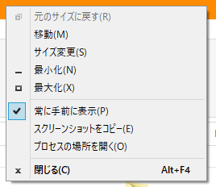
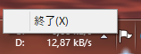

# HookSystemMenu

+ A Windows hook that can add some menu items into each supported window's system menu.
+ Environment: `Windows 10 20H2 x64` `Visual Studio 2019` `msvc2019` `.NET Framework 4.8`

### Tips

+ Bugs: 
    + When close the application, some window's system menu will corrupt.
    + Some actions in some applications (such as Chrome), cannot be invoked.
    + Sometimes some windows cannot show the system menu after modified it.

### Screenshots

|||
|---|---|

### References

+ [ritchielawrence/cmdow](https://github.com/ritchielawrence/cmdow)
+ [AlexanderPro/SmartSystemMenu](https://github.com/AlexanderPro/SmartSystemMenu)
+ [システムメニューにメニューを追加する](https://www.ipentec.com/document/csharp-add-menu-item-in-system-menu)
+ [メニューバー 応用編](http://www-higashi.ist.osaka-u.ac.jp/~k-maeda/vcpp/sec6-3menuapp.html)
+ [C#环境下的钩子详解](https://blog.csdn.net/slimboy123/article/details/5689831)
+ [SetWindowsHookEx API関数解説](https://www.tokovalue.jp/function/SetWindowsHookEx.htm)
+ [ShellProc callback function](https://docs.microsoft.com/en-us/previous-versions/windows/desktop/legacy/ms644991(v=vs.85))
+ [CBTProc callback function](https://docs.microsoft.com/en-us/previous-versions/windows/desktop/legacy/ms644977(v=vs.85))
