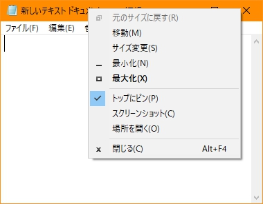
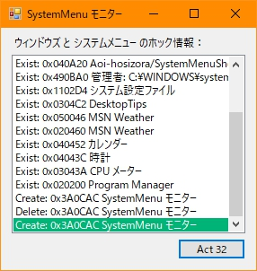

# SystemMenuShell
+ Add some common function into window's system menu

### Principle
+ Make `WH_SHELL` , `WH_CBT` , `WH_GETMESSAGE` global hook
+ Send message when hook through `RegisterWindowMessage()` and `SendNotifyMessage()`
+ Receive message at `WndProc()` and forward window's `WM_SYSCOMMAND` message

### Functions
+ Top most the window
+ Copy the window screenshot
+ Open the process path

### Problems
+ There are some windows (Such as `Chrome` and `Visual Studio 2010`) couldn't hook `WH_GETMESSAGE` message

### Screenshot

### References
+ [システムメニューにメニューを追加する](https://www.ipentec.com/document/csharp-add-menu-item-in-system-menu)
+ [メニューバー 応用編](http://www-higashi.ist.osaka-u.ac.jp/~k-maeda/vcpp/sec6-3menuapp.html)
+ [AlexanderPro/SmartSystemMenu](https://github.com/AlexanderPro/SmartSystemMenu)
+ [C#环境下的钩子详解](https://blog.csdn.net/slimboy123/article/details/5689831)
+ [ritchielawrence/cmdow](https://github.com/ritchielawrence/cmdow)
